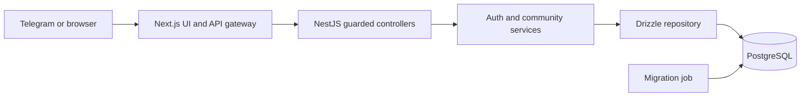

# Architecture

## Boundaries

Next.js owns rendering, local interaction state, Telegram SDK behavior, and the same-origin API gateway. It never connects to PostgreSQL. NestJS owns identity, validation, authorization, domain actions, and transactions. Shared declaration-only contracts contain transport shapes, not database or server implementations.

The responsive design is preserved. The mini app uses a compact client hub renderer with reusable image, brand, dialog, section-heading, and empty-state components. Profile content uses account IDs rather than display names; catalog lookup uses stable IDs rather than array positions. Reward labels derive from the stored balance, so new real accounts are not shown as established demo users.

## Data Model

Catalog: `hoods`, `challenges`, `businesses`, `events`, and `channels`. Profiles: `users`. Content: `posts` and `messages`. User actions: `hood_members`, `challenge_participants`, `saved_businesses`, `event_attendees`, `post_likes`, and `offer_claims`.

Each action table has a composite user/resource primary key. Foreign keys prevent dangling records. Database checks validate body lengths, points, progress, and ratings. Feed/channel timestamps and aggregate membership lookups are indexed. The catalog is persisted, not rebuilt in memory for each request.

Illustrative catalog counts and seed content remain demo data. Real accounts begin at zero points; the local preview and imported prototype retain their illustrative 340-point balance.

## Transactions

Writes lock the acting user's row with `SELECT ... FOR UPDATE`, then mutate relational records inside one transaction. Different users write independently; same-user actions serialize. Two simultaneous saves cannot overwrite each other. Offer claims are conflict-safe and uniquely constrained.

Bootstrap uses a repeatable-read, read-only transaction so profiles, privacy, memberships, totals, and posts share one snapshot. Queries on a transaction connection execute sequentially, avoiding overlapping pg queries.

Toggle commands invert state. Do not automatically retry a mutation after an ambiguous network failure: toggles are not desired-state operations. The UI disables writes while a request is pending. Future public API clients should use explicit join/leave operations with idempotency keys.

## Security

Telegram initData is HMAC-verified server-side with a one-hour validity window. Audience/issuer-scoped sessions expire after 12 hours. Guards derive the acting account from the session; clients never supply another user's ID. Membership is required for publishing posts and channel conversations. Private names/photos are hidden from other accounts. Feed author IDs are returned only for the current user's own content.

Production startup validates configuration, requires a bot token and strong session secret, and always rejects demo login. JSON bodies are bounded, the frontend gateway allowlists endpoints, and Drizzle parameterizes values. Readiness checks the database; liveness does not.

The base Compose stack is deliberately local/demo-enabled. Use the production override for release. Rate limiting currently uses an instance-local store; add a shared store before running multiple API replicas and configure proxy trust deliberately at the edge.

## Deployment

Drizzle Kit generates reviewed, versioned SQL migrations. A separate job applies them under an advisory lock before the API starts. Seeding is a separate optional, conflict-safe operation. The API does not synchronize schema on startup.

Both images use multi-stage builds and non-root runtime users. Next.js uses standalone output. The API runtime excludes development dependencies. PostgreSQL persists in a named volume. API has no published port, a read-only root filesystem, temporary filesystem, dropped capabilities, and no-new-privileges. Web and development database ports bind to loopback.

Production needs TLS at a reverse proxy, backups, a least-privilege database role, environment-secret management, and monitoring. Secrets must not be built into images. The bot username is public and supplied at web build time; the bot token, database credentials, and signing secret remain server-only.

## Tests

Unit tests cover cryptographic validation and authentication policy. PostgreSQL tests create isolated temporary databases and cover migrations, repeatable seeds, concurrency, account isolation, and constraints. Playwright tests the real Docker-backed UI on desktop and mobile, including saved offers, RSVPs, posts, profile identity, school routing, and message persistence. CI runs all layers.

## Product Boundaries

Infrastructure does not turn illustrative courses into an LMS or demo offers into merchant integrations. Public launch still requires moderation/reporting, catalog administration, merchant redemption verification, organizer-verified rewards, account deletion, legal/consent policies, monitoring, and real Telegram device testing. Add those as explicit modules rather than hiding them in frontend components or the persistence repository.